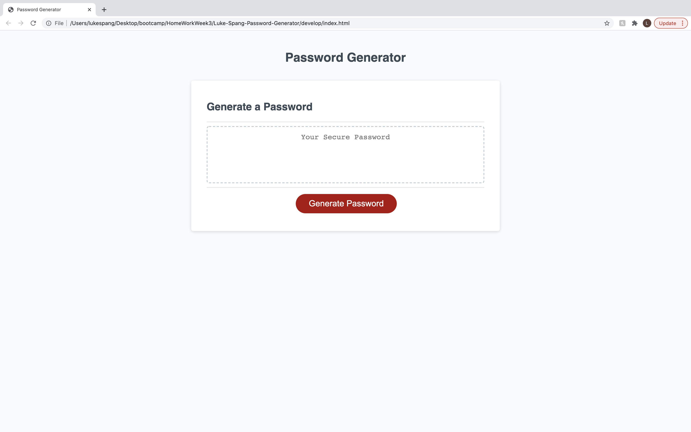
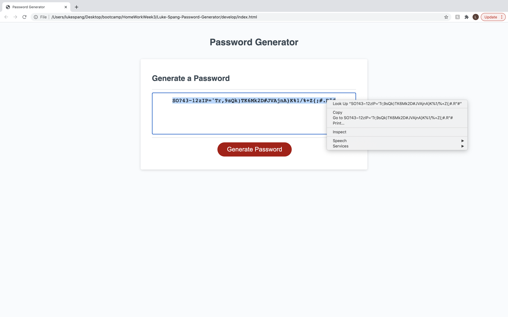

# Luke-Spang-Password-Generator

This is Password Generator! 

This program combines html, css, and javascript to help create a unique password for a user.

Features include:

1. When the generate password button is clicked, the user is provided with prompts about the password criteria.
2. They are able to answer these prompts and the program remembers and uses that information.
3. The program knows that passwords need to be between 8 and 128 characters long and will alert the user if the criteria is not met.
4. The program allows users to include upper case letters, lower case letters, numbers, and special characters in their unique password, and will alert the user if they do not select at least one option.
5. Once all the prompts are answered the program creates the password and displays it in the text box below for the user to copy and use for whatever they need.

Below is the programs current status. 
The Password Generator can be found at _________

